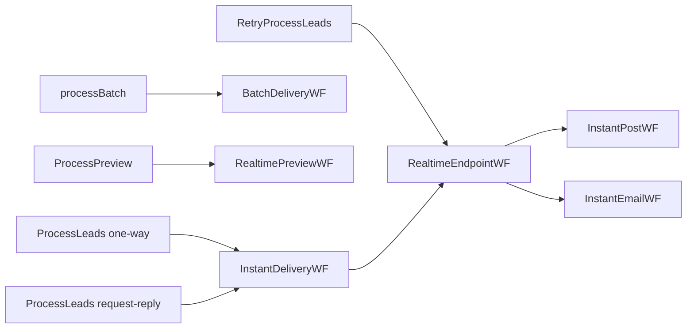

# WCF Workflow Service Operations

Each `.xamlx` in `EDDY.IS.DeliveryEngine.Workflow.Service` is a file-activated WCF Workflow Service. Contracts are **implicit** from `Receive`/`SendReply` activities (no separate C# contract in the service project); the client proxies in `WindowsService/Service References/` confirm the shapes.

**Common facts:**
- **Binding:** `basicHttpBinding`, **security mode `None`** (`WindowsService/app.config:125-152`). No authentication/authorization.
- **Address base:** `http://<host>/EDDY.IS.DeliveryEngine.Workflow.Service/<file>.xamlx`.
- **Faults:** `serviceDebug includeExceptionDetailInFaults="false"` (`Web.config:133`) — no exception detail leaked.
- **Metadata:** `serviceMetadata httpGetEnabled="true"` (`Web.config:131`) — WSDL published.
- **Persistence/tracking:** none (in-memory instances).

---

## 1. ProcessLeads (one-way) — LeadProcessingDeliveryWorkflowService.xamlx

| | |
|---|---|
| **Contract** | `ILeadProcessingDeliveryWorkflowService` |
| **Operation** | `ProcessLeads` |
| **Method/pattern** | One-way (no reply) |
| **Request** | `LeadData : DeliveryLeadData` |
| **Response** | none |
| **Auth** | none (network-trusted) |
| **Business logic** | `InsertTransactionDetail(180)` → `SeLeadProcessingConfigurationValues` → optional `ScoreLead`/`ProcessCap` → `InstantDeliveryWF` → `FinalizeLeadDelivery` → `InsertTransactionDetail(360)` |
| **Validation** | condition matching in `InstantDeliveryWF`; scoring/cap effectively disabled |
| **Errors** | catch → `FinalizeLeadDelivery(555)` + `WriteToDELog` + `ExceptionLoggingActivity` |
| **Dependencies** | `Workflow`, `Workflow.Activities`, DAOs |
| **Caller** | `WindowsService` main loop (`Parallel.ForEach` + `lock`) |

## 2. ProcessLeads (request-reply) — RealtimeLeadProcessingDeliveryWorkflowService.xamlx

| | |
|---|---|
| **Contract** | `IRealtimeLeadProcessingDeliveryWorkflowService` (`http://tempuri.org/`) |
| **Operation** | `ProcessLeads` |
| **Pattern** | Request-reply, correlated (`RequestReplyCorrelationInitializer`) |
| **Request** | `LeadId : int` |
| **Response** | `Status : int` (`SendReply`) |
| **Business logic** | `GetRealtimeLeadData(LeadId)` → if found: `InstantDeliveryWF` → `RemoveRePost`; else log "Not a Valid LeadId" → `GetLeadDeliveryStatus` → reply |
| **Errors** | catch → log + `ExceptionLoggingActivity` |
| **Note** | No generated client proxy in repo for this service (confidence Medium on exact WSDL). |

## 3. processBatch (one-way) — BatchLeadDeliveryWorkflowService.xamlx

| | |
|---|---|
| **Contract** | `BatchLeadDeliveryWorkflowService` |
| **Operation** | `processBatch` |
| **Pattern** | One-way |
| **Request** | `deliveryEndpointId : int`, `productId : int` |
| **Response** | none |
| **Business logic** | `WriteToEventLog` → `BatchDeliveryWF` (gather → transform → build file → email/FTP → status) |
| **Errors** | catch → `WriteToDELog` + `ExceptionLoggingActivity` |
| **Callers** | `WindowsService` CLI `-b`; `Test` harness button (hardcoded endpoint `36677`, product `1`) |

## 4. ProcessPreview (request-reply) — LeadPreviewDeliveryWorkflowService.xamlx

| | |
|---|---|
| **Contract** | `ILeadPreviewWorkflowNewService` |
| **Operation** | `ProcessPreview` |
| **Pattern** | Request-reply, correlated |
| **Request** | `LeadData : DeliveryLeadData` |
| **Response** | `Result : Dictionary<string,string>` |
| **Business logic** | `RealtimePreviewWF` (transform + build payload, **no send**) → `SendReply(Result)` |
| **Errors** | catch → log + `FinalizeLeadPreview(255)` |
| **Note** | Client reference exists in `WindowsService` but is **never called** (dead). |

## 5. RetryProcessLeads (one-way) — RetryLeadDeliveryWorkflowService.xamlx

| | |
|---|---|
| **Contract** | `IRetryLeadDeliveryWorkflowService` |
| **Operation** | `RetryProcessLeads` |
| **Pattern** | One-way |
| **Request** | `RealtimeDeliveryQueueItem`, `LeadData : DeliveryLeadData`, `DeliveryEndpointId : int` |
| **Response** | none |
| **Business logic** | `GetDeliveryEndpoint` → `RealtimeEndpointWF` (single endpoint retry) → `InsertTransactionDetail(520)` |
| **Errors** | catch → `ExceptionLoggingActivity` |
| **Caller** | `WindowsService` retry loop |

---

## Operation → workflow → sub-workflow map

