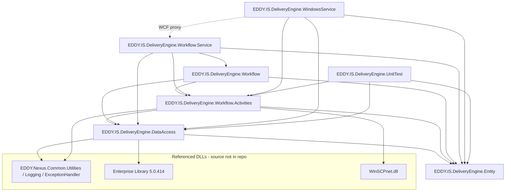

# 2 & 3. Solution Overview and Architecture

## 2.1 Projects in the solution

`EDDY.Services.DE.sln` contains **7 projects** (an 8th, `EDDY.IS.DeliveryEngine.Test`, exists on disk but is **not** in the solution — confirmed by absence from `EDDY.Services.DE.sln:6-19`).

| Project | Type / Output | Target | Purpose |
|---------|---------------|--------|---------|
| `EDDY.IS.DeliveryEngine.Entity` | Class library | .NET 4.5 | Shared domain DTOs / entities (`[DataContract]`) |
| `EDDY.IS.DeliveryEngine.DataAccess` | Class library | .NET 4.5 | DAOs over Enterprise Library + stored procedures |
| `EDDY.IS.DeliveryEngine.Workflow.Activities` | Class library | .NET 4.5 | WF4 code activities (business logic + integration helpers) |
| `EDDY.IS.DeliveryEngine.Workflow` | Class library (WF XAML) | .NET 4.5 | Workflow **definitions** (`.xaml`) |
| `EDDY.IS.DeliveryEngine.Workflow.Service` | Web app / WCF WF host | .NET 4.5 | IIS-hosted WCF workflow services (`.xamlx`) |
| `EDDY.IS.DeliveryEngine.WindowsService` | Windows Service (`Exe`) | .NET 4.5 | Poller/orchestrator; WCF client to the services |
| `EDDY.IS.DeliveryEngine.UnitTest` | Test library | .NET 4.5.2 | MSTest unit/integration tests |
| `EDDY.IS.DeliveryEngine.Test` *(not in sln)* | WinForms (`WinExe`, x86) | .NET 4.5 | Manual dev harness (fork of Windows Service) |

Per-project detail: [Projects/](./Projects/).

## 2.2 Project references & dependency graph

Project-to-project references (from the `.csproj` files):



**Key observations**

- **`Entity` is the shared foundation** (no project deps of its own).
- **`WindowsService` does NOT reference `Workflow`/`Workflow.Service` as projects** — it talks to the services over WCF using generated client proxies (see [APIs/](./APIs/)). Confidence: **Very high** (`WindowsService.csproj:399-410` lists only Activities/DataAccess/Entity; `Service References/` holds proxies).
- **No NuGet.** Every third-party dependency is a direct DLL reference from a `..\..\..\lib\`-style path or the GAC. There is **no `packages.config`** in any project.

## 2.3 Startup sequence & application lifecycle

There are **two independently deployed runtime processes**.

### A) Windows Service ("Delivery Service") — the driver

```mermaid
sequenceDiagram
    participant SCM as Windows SCM
    participant P as Program.cs
    participant WLS as WorkflowLauncherService
    participant T as Worker Thread
    participant DB as Nexus DB
    participant WCF as WCF Workflow Services (IIS)

    SCM->>P: start (no args)
    P->>WLS: ServiceBase.Run(new WorkflowLauncherService())
    Note over WLS: ctor creates LeadProcessing/Retry hosts (NOT started)
    SCM->>WLS: OnStart()
    WLS->>T: new Thread(ProcessDeliveryWorkflow).Start()
    loop every ~5s until _stop signalled
        T->>DB: GetNewLeadsForProcessing / GetRDQsForProcessingReposts / GetThirdPartyLeadsForProcessing
        DB-->>T: leads / RDQ items
        T->>WCF: ProcessLeads(...) / RetryProcessLeads(...)  (Parallel.ForEach + lock)
    end
    SCM->>WLS: OnStop()
    WLS->>T: _stop.Set(); _worker.Join()
```

- Entry point: `Program.cs:17-27` (`ServiceBase.Run`). CLI batch mode: `Program.cs:29-49` (`-b <endpointId> <productId>`).
- Loop cadence: `Thread.Sleep(5000)` (~5s) + `_stop.WaitOne(10)` for shutdown; a code comment claims 90s but that is stale. `WorkflowLauncherService.cs:159-164`. Confidence: **Very high**.
- **Concurrency:** work is dispatched with `Parallel.ForEach` but each WCF call is wrapped in `lock (Locker)`, which **serializes** the actual service calls. `WorkflowLauncherService.cs:284,302-306,325,343-347`. Confidence: **Very high**.
- Feature flags read from `appSettings`: `Process_RealTime_Lead_Delivery`, `Process_Retry_Lead_Delivery`, `Process_ThirdParty_Delivery`, `Number_Parallel_Processes`, `IsBeta`. `WorkflowLauncherService.cs:134-151`.
- The self-hosting `WorkflowServiceHost` path (`LeadProcessingWorkflowHost`, `RetryLeadProcessingWorkflowHost`, `LeadPreviewWorkflowHost`) is **present but disabled** — `_leadProcessingHost.Start()` is commented out (`WorkflowLauncherService.cs:76`); only `Stop()` is called on shutdown. Confidence: **Very high**.

### B) WCF Workflow Services (IIS) — the executor

- Each `.xamlx` is a file-activated WCF workflow service. There is **no explicit `<services>`/`<bindings>`** in `Web.config`; endpoints are implied by `Receive` activities and default protocol mapping. `Web.config:126-138`.
- A request (`ProcessLeads`, `RetryProcessLeads`, `processBatch`, `ProcessPreview`) instantiates the workflow, which composes activities and sub-workflows, then completes. `SendReply` returns a status for request-reply services.
- **No SQL workflow persistence or tracking** is configured anywhere (grep across the solution for `SqlWorkflowInstanceStore`/`SqlTracking`/`persistenceProvider` finds nothing). Workflow instances are **in-memory / non-durable**; durability comes from the DB (RDQ + status), not WF persistence. Confidence: **High**.

See [Diagrams/DataFlow.md](./Diagrams/DataFlow.md) for the full request lifecycle.

## 3.1 Architecture style

**Primarily a layered (N-tier) architecture, orchestrated by Windows Workflow Foundation.** Secondary patterns present:

| Style / pattern | Present? | Evidence |
|-----------------|----------|----------|
| **Layered / N-tier** | ✅ Primary | Entity → DataAccess → Activities → Workflow → Service/Host |
| **Workflow / orchestration (WF4)** | ✅ | `.xaml`/`.xamlx` compose `CodeActivity`s |
| **SOA (WCF services)** | ✅ | Workflow services exposed over `basicHttpBinding` |
| **Pipeline (transformation)** | ✅ | Ordered `IDataTransformationTask` pipeline (`DataTransformationBC`) |
| **Service Locator (static)** | ✅ | `*DataService` static DAO holders |
| **Clean/Onion/Hexagonal** | ❌ | No dependency inversion; concrete `new` + static locators |
| **CQRS** | ❌ (partial by accident) | Reads/writes both go through DAOs+SPs; no formal separation |
| **Microservices** | ❌ | Single logical service, single DB |
| **Event-driven** | ⚠️ Queue-ish | RDQ is a DB-backed work queue polled by the service; not a message bus |

### Why it was built this way (assessment, medium confidence)

- **Era & ecosystem.** Naming (`Cheetah`, `Nexus`, `EDDY`), Enterprise Library 5, WF4, and TFS point to a **~2010–2015 Microsoft enterprise stack**. WF4 + WCF Workflow Services was Microsoft's recommended approach for long-running, visually-modeled business processes at that time.
- **Business fit.** Delivery is naturally a **process** (match → transform → deliver → interpret → retry/finalize) with per-partner variation. Modeling it as workflows lets non-happy-path branches (blackout, retry, max-attempts, preview) be expressed declaratively.
- **Config-over-code.** Fat stored procedures + XML-in-DB (condition XML, transformation task XML, endpoint detail XML) let ops onboard partners without redeploying binaries.

## 3.2 Architectural violations & smells

| Violation | Where | Impact |
|-----------|-------|--------|
| **Business logic in the database** (SPs) | ~110+ SPs in `DataAccess/*` | Core rules invisible to this repo; hard to test/version |
| **Static service locator instead of DI** | `DataService/*.cs`, `new XxxDAO()` everywhere | Hidden dependencies; hard to mock (tests must swap static fields) |
| **Global mutable state** | `ServicePointManager.ServerCertificateValidationCallback` set per request (`HTTPPost.cs:80-81`) | AppDomain-wide side effect; TLS trust disabled globally |
| **Config ignored / hardcoded** | `SeLeadProcessingConfigurationValues.cs:23-24` hardcodes `ProcessCap=false`, `ScoreLead=false` despite `Web.config:106-107` | Silent behavior divergence from config |
| **Duplicated code across layers** | `Entity/ConditionValidator/FieldToCompare.cs` vs `DataAccess/Common/FieldToCompare.cs` (latter not compiled); forked `Activities/` copies in `Workflow.Service` | Confusion, drift |
| **God classes** | `ConditionBC` (~1080), `DataTransformationBC` (~805), `DeliveryEngineDAO` (~3800), `DeliveryEngineBC` (~315) | Low maintainability |
| **Leaky duplication of activities** | `Workflow.Activities` vs `Workflow.Service/Activities` (6 compiled + 51 stale) | Which one runs? (compiled set only) |
| **Layer skipping** | Workflows and hosts call `*DataService` DAOs directly, and also `DeliveryEngineBC` facade | No single seam for persistence |
| **Config drift** | `Web.Release.config` conflicting connection strings; installer name ≠ `ServiceName` | Deploy-time surprises |

## 3.3 Dependency Injection (Section 12)

**There is no DI container in use in source code.** Confidence: **High**.

- Unity DLLs (`Microsoft.Practices.Unity*`) appear only as **transitive** build outputs under `bin/`/`obj/` (pulled in by Enterprise Library). No `IUnityContainer`, `container.Resolve`, or Unity configuration exists in any `.cs` or `.config` (grep-confirmed).
- Object lifetimes are managed by **`new`** and **static holders**:

| "Lifetime" | Mechanism | Example |
|------------|-----------|---------|
| Effective **singleton** | `static` DAO instance in a `*DataService` holder | `DeliveryEngineDataService.DeliveryEngineDAO` |
| **Transient** | `new XxxDAO()` / `new XxxBC()` per call | `DeliveryEngineBC` methods (`Helper/DeliveryEngineBC.cs:17-309`) |
| Per-activity | WF4 instantiates activities per execution | all `CodeActivity` |
| **Hosted service** | `ServiceBase` + one worker `Thread` | `WorkflowLauncherService` |
| **Background service** | The poll loop thread | `ProcessDeliveryWorkflow` |
| Locked singleton | `ProductProcessingTransactionManager` with `lock(_Locker)` | `ProductProcessing/ProductProcessingTransactionManager.cs:17-24` |

There are **no factories** in the DI sense; the closest is the **task factory switch** in `DataTransformationBC.CreateOperationDictionary` and the **`BlackoutFactory`** in `Entity/DeliveryBlackoutPeriod.cs`.

See [Diagrams/DependencyGraphs.md](./Diagrams/DependencyGraphs.md).

## 3.4 Configuration (Section 13)

- **`appsettings`**: delivery flags and infra live in `appSettings` (`Web.config:87-113`, `WindowsService/app.config:79-117`). Key keys: `ProcessCap`, `ScoreLead`, `DeliverLead`, `ApplicationIdtoDeliver`, `DeliverySMTPServer`, `DeliveryEmailFrom(GS)`, `BatchFilePath`, `DefaultPOSTRetryAttempts`, `EmailRetryMax`, `MachineKey`, `DE_LogVerbosityLevel`, `IsDebugMode`, `IsBeta`, `Number_Parallel_Processes`, `Process_RealTime_Lead_Delivery`, `Process_Retry_Lead_Delivery`, `ServiceXAMLDirectory`.
- **Connection strings**: `Nexus` (default), `EddyTracking`, `EddyLogging` — all **Windows Integrated Security** (no SQL passwords). `Web.config:82-86`.
- **`Options` classes / strong binding**: **None.** Config is read ad hoc via `ConfigurationManager.AppSettings[...]` throughout activities and hosts.
- **Feature flags**: implemented as `appSettings` booleans (`ProcessCap`, `DeliverLead`, `Process_*`). Note the hardcode override in `SeLeadProcessingConfigurationValues.cs:23-24`.
- **Secrets**: committed in config (SMTP hosts/IPs, alert emails, internal hostnames) — see [Security/](./Security/). Publish encryption key `DeployEncryptKey` = URL-encoded `Ch$$TAH!` in `.csproj` files.
- **Environment binding**: `Master.config` templates (`output="Web.config"`/`.exe.config`) with `@@NEXUSDBSERVER`/`@@ENVIRONMENT` tokens, plus Web.config XDT transforms per build configuration. See [Deployment/](./Deployment/) and [Configuration in Projects/](./Projects/).

## 3.5 Authentication & Authorization (Section 14)

**There is effectively no application-level authN/authZ in this repo.** Confidence: **High**.

- **WCF services**: `basicHttpBinding` with **security mode `None`** (client config `WindowsService/app.config:125-152`); no message/transport security, no client credentials, no `[PrincipalPermission]`, no WCF authorization policies. The services trust the network boundary (intended for internal-only hosting).
- **No JWT, no cookies, no ASP.NET Identity, no claims, no roles/policies** anywhere (grep-confirmed).
- **Database**: authenticates via **Windows Integrated Security** (the service account / app-pool identity). The Windows Service runs as **LocalSystem** (`ProjectInstaller.Designer.cs:36`).
- **Partner endpoints**: outbound auth is per-endpoint config (FTP/SFTP username+password from endpoint records; HTTP auth is whatever the target URL/headers embed, e.g., API keys in query string). No inbound authentication of partners.
- **Metadata exposure**: `serviceMetadata httpGetEnabled="true"` (`Web.config:131`) publishes WSDL — a hardening gap for a service with no auth.

There is a **"permission model" only in the business sense**: which `ApplicationId`s a host will process (`ApplicationIdtoDeliver`, `Web.config:110`) and machine affinity for the RDQ (`MachineKey`/`MachineName`). That is workload partitioning, not security.

## 3.6 Background processing (Section 15)

- **Hosted/background service:** the Windows Service worker thread (`ProcessDeliveryWorkflow`) is the sole background processor. `WorkflowLauncherService.cs:128-252`.
- **Scheduler:** a simple `Thread.Sleep(5000)` poll loop — **no Hangfire, Quartz, Azure Functions, or Windows Task Scheduler** in the code (grep-confirmed). Batch delivery is triggered externally (CLI `-b`, harness button, or an operator/other system invoking the batch WCF service).
- **Queues:** the **Realtime Delivery Queue (RDQ)** is a **database table** polled by the service and manipulated by activities (`CreateRDQItem`, `UpdateRDQFailedStatus`, `UpdateRDQForBlackout`, `RemoveRDQItem`, `GetRDQsForProcessingReposts`). Machine affinity via `DeliveryEngineMachineKey`.
- **Retry logic:** realtime POST retries up to `MaxRetryAttempts` (per endpoint / `DefaultPOSTRetryAttempts`), scheduling `NextDeliveryAttemptDatetime` (status 515), giving up at max (status 610). `InstantPostWF.xaml:114-149`. Blackout defers attempts (status 516). Email delivery has SMTP-level retry (`EmailRetryMax`) but **no** RDQ max-retry branch (`InstantEmailWF.xaml`).

See [BusinessProcesses.md](./BusinessProcesses.md) and [Services/BackgroundProcessing.md](./Services/BackgroundProcessing.md).

## 3.7 Logging (Section 17)

- **Enterprise Library Logging block** is the primary framework (`Web.config:8-49`, `app.config:8-71`). Listeners:
  - **Database** (`EddyLogging` DB) via SPs `WriteLog` (category `General`) and `EDDY_WriteException` (category `Category`). `Web.config:10-11`.
  - **Flat file** `C:\Cheetah\Log Files\Log.log`. `Web.config:12`.
  - **Email** listener (commented out in category sources) to `rkamenetskiy@EducationDynamics.com` via SMTP `165.212.65.102`. `Web.config:13`.
- **Domain logging** goes through `EDDY.Nexus.Common.Logging.EDDYLogger` and DB temp logs: `WriteToDELog` / `WriteToRealtimeDELog` write to a `EDDY_DE_TempDeliveryEngineLog_Insert` table and also insert **transaction detail** (`EddyTracking`) when an `ActivityStepId` is present. `WriteToDELog.cs:27-81`.
- **Windows Event Log** (source `"EDDY"`) for unhandled workflow exceptions. `Helper/ExceptionLoggingActivity.cs:19`, `Activities/WriteToEventLog.cs:19`.
- **Structured logging / correlation IDs / App Insights / Serilog / NLog:** **none.** Logs are largely free-text messages (truncated). `DE_LogVerbosityLevel` (0–6) gates verbosity. Confidence: **High**.

## 3.8 Exception handling (Section 18)

- **Enterprise Library Exception Handling block** defines named policies (`Web.config:50-80`): `WorkflowService Exception Policy` (log, `postHandlingAction=None`), `DataAccess Exception Policy` (log + `ThrowNewException`), `DataAccess Exception Policy No Rethrow` (log only). Windows Service adds `UserInterface Exception Policy No Rethrow`.
- **Workflow-level:** each `.xamlx` and several `.xaml` wrap their body in `TryCatch`; catch blocks call `WriteToDELog` + `ExceptionLoggingActivity`. The **Service** copy of `ExceptionLoggingActivity` also runs the EntLib `WORKFLOW_SERVICE_POLICY` handler (`Workflow.Service/Activities/ExceptionLoggingActivity.cs:21-22`), whereas the Activities copy only writes the Event Log.
- **Global middleware:** none in the ASP.NET sense; WCF faults are shaped by `serviceDebug includeExceptionDetailInFaults="false"` (`Web.config:133`) — exception detail is **not** leaked to clients (good).
- **Compensation:** no WF `CompensableActivity`/`Compensate` usage; failure handling is manual (status writes, RDQ updates, `FinalizeLeadDeliveryOnError`). Batch failure path throws `InvalidOperationException` after marking leads failed (`BatchDeliveryWF.xaml:249-266`).
- **Notable anti-patterns:** `GetRealtimeLeadData.cs:18-40` swallows all exceptions silently; `Helper/Email.cs:135-138` does `throw ex;` (resets stack trace).

See [Security/ExceptionAndErrorHandling.md](./Security/ExceptionAndErrorHandling.md) is folded into [Security/](./Security/) and [Performance/](./Performance/) where relevant.
