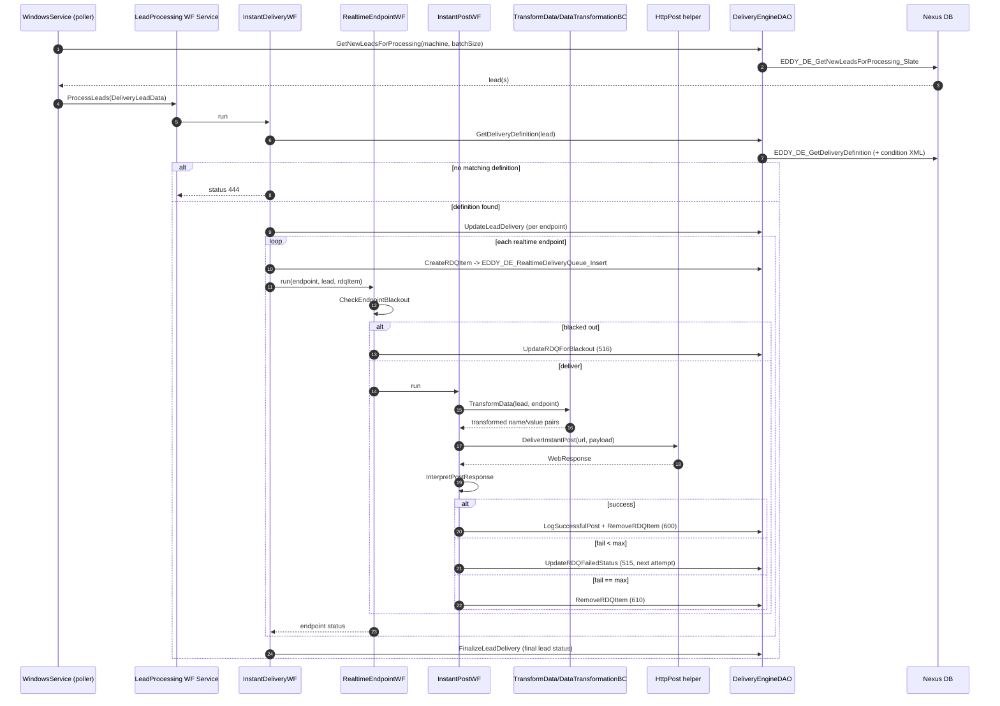
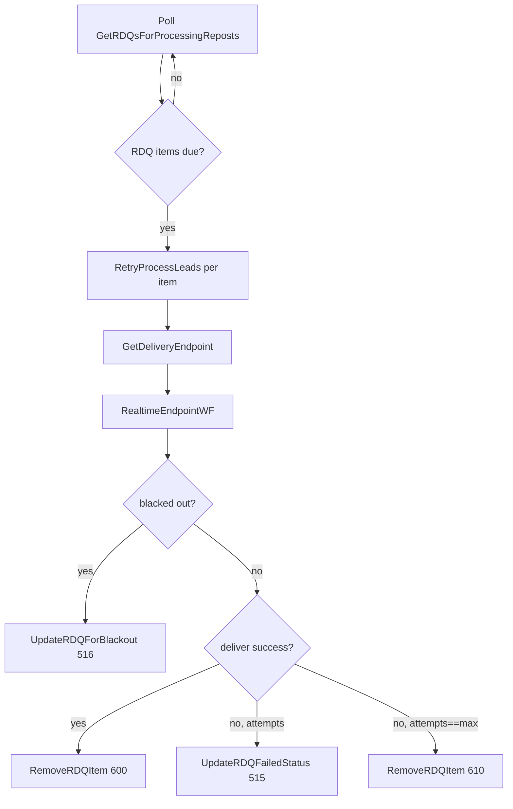
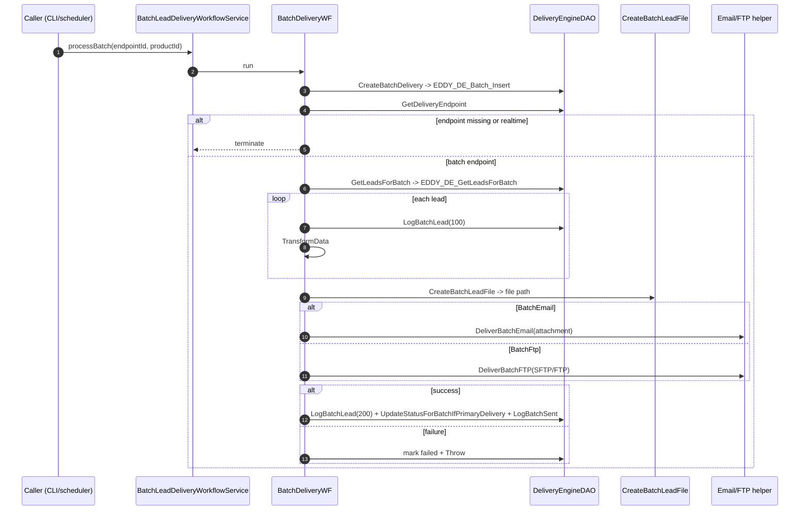
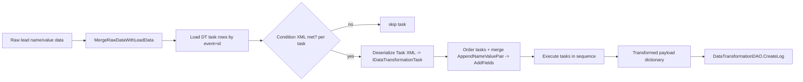
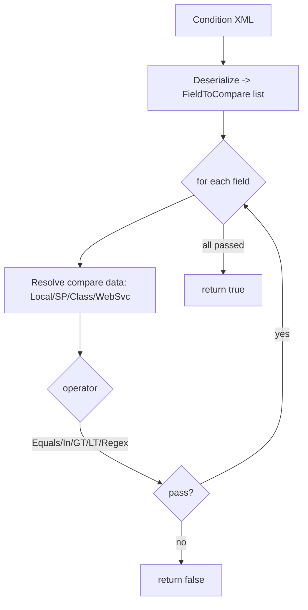

# 7 & 26 & 28. Business Processes, Sequence Diagrams, Flowcharts

This document describes every major business process, with inputs/outputs, validation, rules, edge cases, failure handling, related classes, related (inferred) tables, and Mermaid diagrams.

Status codes are referenced throughout; see the [status code reference](#status-code-reference) at the end. Confidence on numeric literals is **very high** (read directly from `.xaml`/activity source); confidence on their **semantic names** is **medium** (inferred from usage).

---

## Process 1 — Realtime lead delivery (the core flow)

**Trigger:** Windows Service poll finds a new lead → calls `LeadProcessingDeliveryWorkflowService.ProcessLeads` (one-way) or the realtime variant returns a status (request-reply).

**Entry workflow chain:** `LeadProcessingDeliveryWorkflowService.xamlx` → `InstantDeliveryWF.xaml` → (per realtime endpoint) `RealtimeEndpointWF.xaml` → `InstantPostWF.xaml` / `InstantEmailWF.xaml`.

**Inputs:** `DeliveryLeadData` (or `LeadId` for the realtime request-reply service).
**Outputs:** aggregate `LeadRealtimeDeliveryStatus`, `SchoolValidationResponseStatus`; RDQ rows; delivery logs; finalized lead status.

**Rules & steps:**
1. `SeLeadProcessingConfigurationValues` decides scoring/cap/deliver flags — but hardcodes `ProcessCap=false`, `ScoreLead=false`; only `DeliverLead` honored from config. `SeLeadProcessingConfigurationValues.cs:23-25`.
2. If scoring enabled → `ScoreLead` (currently returns constant `100`). `ScoreLead.cs`, `LeadScoring/LeadScoringBusinessComponent.cs:10-13`.
3. If capping enabled → `ProcessCap` (delegates to `CapDistributionComponent.ProcessCap`). Currently gated off.
4. If delivering → `InstantDeliveryWF`:
   - Default status `110`.
   - `GetDeliveryDefinition` selects the **highest-priority active** definition whose **Condition XML** matches the lead; if none → status `444`. `GetDeliveryDefinition.cs:26-111`.
   - `UpdateLeadDelivery` creates per-endpoint delivery records. `UpdateLeadDelivery.cs`.
   - `ForEach` endpoint: if `IsRealtime`, `CreateRDQItem` → run `RealtimeEndpointWF` → `AdjustLeadRealtimeStatus`; else log (batch handled elsewhere). `InstantDeliveryWF.xaml:92-148`.
5. `RealtimeEndpointWF`:
   - `CheckEndpointBlackout`; if blacked out → `UpdateRDQForBlackout` (status `516`). `RealtimeEndpointWF.xaml:49-76`.
   - else `Switch` on delivery type → `InstantPostWF` or `InstantEmailWF`.
   - if last attempt and success → `UpdateLeadStatusIfLastRealtimeDelivery`.
6. `InstantPostWF`:
   - `TransformData` → `CreatePostData` → `DeliverInstantPost`. `InstantPostWF.xaml:60-64`.
   - increment `CurrentDeliveryAttempts`; `InterpretPostResponse`.
   - success → `LogSuccessfulPost` → `RemoveRDQItem` → status `600`.
   - failure & attempts ≥ max → `RemoveRDQItem` → status `610`.
   - failure & attempts < max → `UpdateRDQFailedStatus` (status `515`, sets next attempt time).
7. `FinalizeLeadDelivery` writes the final lead status (one-way lead processing service). `LeadProcessingDeliveryWorkflowService.xamlx:91-105`.

**Validation:** condition XML matching (`ConditionBC`), school-validation response parsing (`InterpretPostResponse`), repost bypass of regex conditions (`ConditionBC.cs:245-248`).

**Edge cases:** no matching definition (`444`); blackout window (`516`); duplicate/reject/auto-review responses (`450`/`460`/`600`); HTTP 200 but body mismatch (`475`); repost leads bypass regex conditions.

**Failure handling:** per-endpoint try/catch → `WriteToDELog` + `ExceptionLoggingActivity`; service-level catch → `FinalizeLeadDelivery` status `555`.

**Related classes:** `GetDeliveryDefinition`, `UpdateLeadDelivery`, `CreateRDQItem`, `TransformData`, `CreatePostData`, `DeliverInstantPost`, `InterpretPostResponse`, `AdjustLeadRealtimeStatus`, `FinalizeLeadDelivery`.

**Related (inferred) tables:** `Lead`, `DeliveryDefinition`, `DeliveryEndpoint`, `RealtimeDeliveryQueue`, `RealtimeDeliveryLog`. See [Database/](./Database/).

---

## Process 2 — Retry delivery (RDQ reposts)

**Trigger:** `Process_Retry_Lead_Delivery=true` → service polls `GetRDQsForProcessingReposts` → `RetryProcessLeads`.

**Entry:** `RetryLeadDeliveryWorkflowService.xamlx` → `GetDeliveryEndpoint` → `RealtimeEndpointWF` → `InsertTransactionDetail` (step 520).

**Inputs:** `RealtimeDeliveryQueueItem`, `DeliveryLeadData`, `DeliveryEndpointId`.
**Outputs:** updated RDQ + delivery status.

**Rules:** re-runs a **single endpoint** for a queued lead using the same `RealtimeEndpointWF` (so blackout/retry/max-attempt logic is identical to realtime).

**Edge cases / failure:** catch → `ExceptionLoggingActivity` only (no status finalize here).

**Related classes:** `GetDeliveryEndpoint`, `RealtimeEndpointWF`, `UpdateRDQFailedStatus`, `RemoveRDQItem`, `InsertTransactionDetail`.

---

## Process 3 — Batch delivery

**Trigger:** external call to `BatchLeadDeliveryWorkflowService.processBatch(deliveryEndpointId, productId)` (CLI `-b`, harness button, or scheduler/other system).

**Entry:** `BatchLeadDeliveryWorkflowService.xamlx` → `BatchDeliveryWF.xaml`.

**Inputs:** `DeliveryEndpointId`, `ProductId`. **Outputs:** `BatchDeliveryId`, `Success`, `EndPoint`.

**Steps (`BatchDeliveryWF.xaml`):**
1. Log start; `CreateBatchDelivery` → `BatchDeliveryId` (`:49-50`).
2. `GetDeliveryEndpoint`; guard: missing endpoint → terminate; guard: realtime endpoint → terminate (`:55-80`).
3. `GetLeadsForBatch` → `Leads[]` (`:87-88`). Zero-lead does **not** terminate (`:90-101`).
4. `ForEach` lead: `LogBatchLead(100)` → `TransformData` → collect; on error: log + `LogBatchLead(555)` (`:115-170`).
5. `CreateBatchLeadFile` → `BatchFilePath` (delimited or XML, under a dated directory tree) (`:182`, `CreateBatchLeadFile.cs`).
6. `Switch` delivery type → `DeliverBatchEmail` or `DeliverBatchFTP` (`:185-207`).
7. If `Success`: mark leads `200`, `UpdateStatusForBatchIfPrimaryDelivery`, `LogBatchSent`; else mark failed + `Throw` (`:209-266`).
8. Outer catch → log event 999 + `ExceptionLoggingActivity`.

**Validation:** endpoint must be batch (not realtime); GS products (16/17) with empty batch skip email (`DeliverBatchEmail.cs:39`).

**Related (inferred) tables:** `BatchDelivery`, `BatchDeliveryLog`, `Lead`, `DeliveryEndpoint`.

---

## Process 4 — Data transformation pipeline

**Purpose:** reshape a lead's raw name/value data into the partner's required payload, per endpoint.

**Entry:** `TransformData.cs:141-196` → `DataTransformationBC.Transform(rawData, metaData, EventType.Delivery, endpointId, log)`.

**Pipeline (`DataTransformation/DataTransformationBC.cs`):**
1. `MergeRawDataWithLeadData` (`:645-697`).
2. `CreateOperationDictionary` (`:496-612`): load transformation task rows from DB by event type + id; for each, evaluate its **Condition XML** with `ConditionBC.IsConditionMet`; deserialize **Task XML** → `Tasks` DTO → concrete `IDataTransformationTask` (factory `switch`).
3. Merge passing `AppendNameValuePair` tasks into a single `AddFields`; **at least one is mandatory** else `ArgumentException` (`:408-411`).
4. Execute tasks in sequence: `task.Transform(outputDictionary, ref log)` (`:415-419`).
5. Log via `DataTransformationDAO.CreateLog` (`:177-186`).

**Task types (Strategy pattern, `IDataTransformationTask`):** `AppendNameValuePair`, `AddFields`, `ChangeFieldNames`, `FieldValueMapping`, `RemoveFields`, `FormatDateTime`, `FormatTelephoneNumber`, `ApplyXsltForXml`, `SetEmailTo`, `SetEmailSubject`.

**Notable rules/edge cases:**
- `ApplyXsltForXml` **replaces the entire output** with the XSLT result under `OverwriteName`/`"TransformedXml"`; uses temp files in `C:\DeliveryTransformationTemp\DT_Temp` with 3 retries. `ApplyXsltForXml.cs:39-106`.
- `SetEmailTo` can resolve recipients via SP `Eddy_DE_LookUpDeliveryEmail`. `SetEmailTo.cs:72`.
- `FieldValueMapping` maps locally or via SP `EDDY_DT_GetValueCodeFromProgramId`.

---

## Process 5 — Condition evaluation (lead matching)

**Purpose:** decide whether a lead matches a Delivery Definition or a transformation task.

**Entry:** `ConditionValidator/ConditionBC.cs` (`GetMatchingConditions`, `IsConditionMet`, `AreCondtionsMet` `:156-199`).

**Rules:** a `Condition` holds `FieldToCompare[]`; **all must pass (AND)**. Operators: `Equals`, `In`, `GreaterThan(OrEqualTo)`, `LessThan(OrEqualTo)` (numeric only), `RegularExpression`, `Other` (no-op). Data sources: `Local` (literal/CSV/pipe list), `StoredProcedure` (`ConditionDao.GetComparisonTable`), `Class` (reflection plug-in via `RemoteData`), `Webservice` (**TODO stub**). `ConditionBC.cs:213-329`.

**Edge cases:** empty/null condition XML ⇒ always true (`:113-129`); `csrid` field name mapped to `CRId` (`:177`); repost leads bypass regex conditions (`:245-248`); debug mode logs each match/fail.

---

## Process 6 — Preview (dry run)

**Entry:** `LeadPreviewDeliveryWorkflowService.ProcessPreview(LeadData)` (request-reply) → `RealtimePreviewWF.xaml`.

**Behavior:** selects the delivery definition; for each realtime endpoint runs `TransformData` + `CreatePostData`/`CreateEmailBody` and logs the **would-be** payload into a `Result` dictionary — **no HTTP/email is actually sent**. If no definition → `PreviewError` populates `Result` with `"Error" → "Delivery definition not found"`. `RealtimePreviewWF.xaml:43-124`, `PreviewError.cs:13-19`.

**Output:** `Dictionary<string,string> Result` returned via `SendReply`.

---

## Process 7 — Cap distribution (largely inert in current code)

**Intent:** limit lead volume per client/school/level over a date range.

**Reality in this codebase:**
- `GetCap.cs:11-21` always returns not-capped.
- `SeLeadProcessingConfigurationValues.cs:23` hardcodes `ProcessCap=false`, so `ProcessCap` activity is skipped in lead processing regardless of `Web.config:106` (`ProcessCap=true`).
- `CapDistributionComponent.GetCap` calls the DAO but returns an empty list (`Cap/CapDistributionComponent.cs:30-35`).
- Admin CRUD for caps is functional via `CapDistributionDAO` (`Eddy_CreateCap`, `Eddy_EditCap`, `EDDY_UpdateCapValue`, `CAP_ExecuteCappingProcess`).

**Confidence:** **High** that runtime capping in the delivery path is currently a no-op.

---

## Process 8 — Admin / Lead Viewer operations

Not a workflow — a set of DAO/BC operations invoked by an external admin UI (not in this repo). Covered in [Services/DeliveryEngineBC.md](./Services/DeliveryEngineBC.md) and [APIs/](./APIs/). Includes: manage definitions/endpoints/blackouts/HTTP headers/email templates; search leads (`EDDY_DE_GetLeadViewerSearchResultsDynamic`), view/append history, edit lead data, mark for repost, scrub leads.

---

## Status code reference

Inferred from `AdjustLeadRealtimeStatus.cs:24-62`, `GetLeadRealtimeStatusFromEndpointStatuses.cs:24-49`, `InterpretPostResponse.cs:46-190`, and the workflow `Assign` literals. Numeric values: **very high** confidence; names: **medium**.

| Code | Meaning (inferred) |
|------|--------------------|
| 110 | Processing / initial |
| 120 | Partially processed / retrying |
| 200 | Delivered success (live, batch) |
| 220 | Delivered success (test mode) |
| 255 | Preview finalize |
| 301 / 321 | Internal / scrub delivered |
| 410 / 420 | Permanent endpoint failure (live / test) |
| 444 | No delivery definition found |
| 450 | Duplicate (school validation) |
| 460 | Failure response matched |
| 475 | HTTP 200 but body mismatch |
| 480 | Force repost |
| 485 | HTTP failure |
| 490 | Ambiguous response |
| 515 | Endpoint failed, retry scheduled |
| 516 | Endpoint blacked out, deferred |
| 555 | Workflow/exception failure |
| 600 | Success (+ possible auto-review) |
| 610 | Endpoint permanently failed (max retries) |
