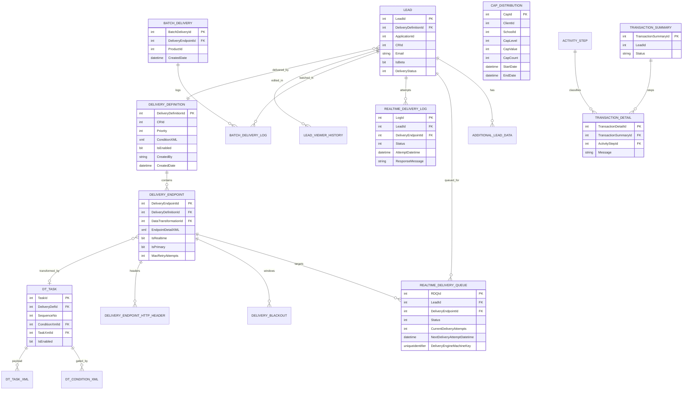

# Inferred ER Diagram

> **INFERRED (Medium–High confidence).** No schema artifacts exist in the repo; this diagram is reconstructed from stored-procedure names, entity `*TableField` enums, `IDataReader` column usage, and entity mappings. Column lists are representative, not exhaustive. Column data types, PKs/FKs, indexes, and constraints must be confirmed against the live `Nexus`/`EddyTracking` databases.



## Notes on inferred relationships

- **`LEAD.DeliveryDefinitionId`** is set by `EDDY_DE_Lead_UpdateDeliveryDefinition` (`UpdateLeadDeliveryDefinition`) — the chosen definition per lead.
- **`REALTIME_DELIVERY_QUEUE.DeliveryEngineMachineKey`** partitions work across delivery-engine machines (`GetNewLeadsForProcessing` takes a machine key).
- **`DT_TASK`** links to condition/task XML rows; the actual transformation logic is XML content, not columns.
- **`TRANSACTION_SUMMARY`/`TRANSACTION_DETAIL`/`ACTIVITY_STEP`** live in the **`EddyTracking`** database, separate from `Nexus`.
- **Beta shadow tables** (parallel `*Beta*` SP variants) suggest a duplicated lead/lead-data path used for A/B or migration; not modeled above (confidence Medium).

## Recommended next step (to make this authoritative)

Extract the real schema from the databases, e.g.:

```sql
-- run against Nexus and EddyTracking
SELECT s.name AS [schema], t.name AS [table] FROM sys.tables t JOIN sys.schemas s ON s.schema_id=t.schema_id ORDER BY 1,2;
SELECT name FROM sys.procedures ORDER BY name;      -- compare to StoredProcedures.md
SELECT name, definition FROM sys.sql_modules;       -- SP/view/function bodies (the real business logic)
-- plus sys.foreign_keys, sys.indexes, sys.triggers
```

Commit the results (or an SSDT `.sqlproj`) so the schema is versioned alongside the code.
