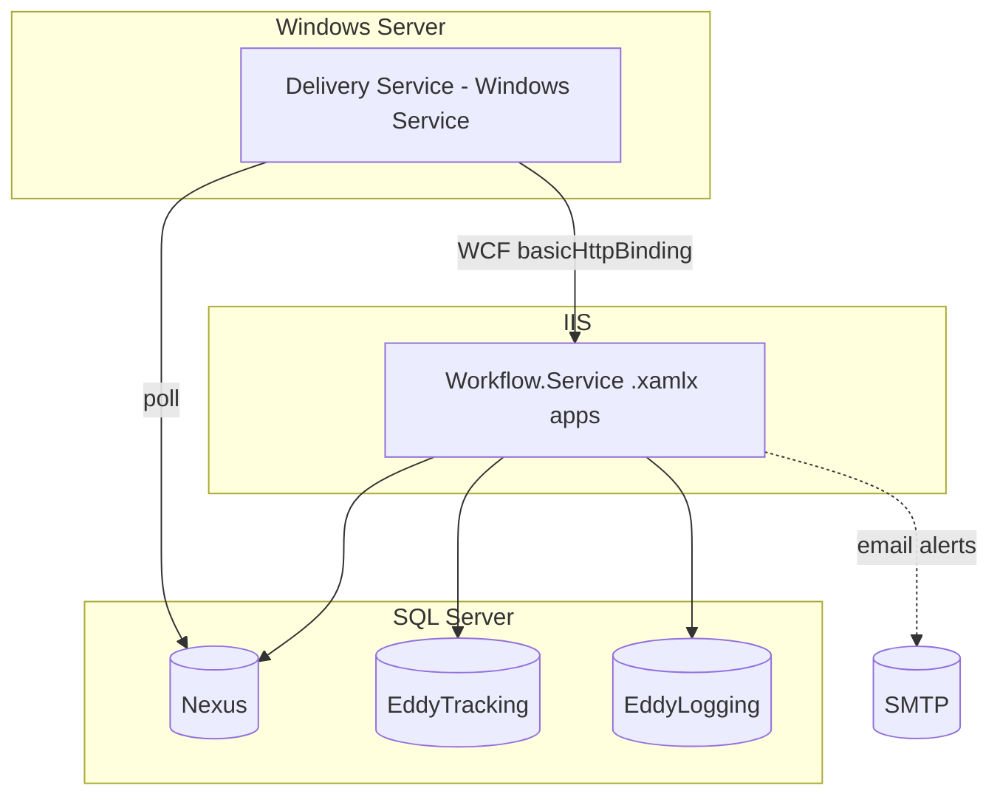

# 24. Deployment

## Topology

Two deployable units + shared databases:

## Build process

- **Toolchain:** Visual Studio 2015 (`EDDY.Services.DE.sln:3-4`), MSBuild, .NET Framework 4.5 / 4.5.2. No `dotnet` CLI, no `.NET SDK`-style projects (classic `.csproj`).
- **Dependencies:** direct DLL references (`..\..\..\lib\...`) + GAC; **no NuGet restore**. The `lib` folder is **not in this repo** — builds require those DLLs to be provisioned.
- **Signing:** ClickOnce manifest signing for the Windows Service (`WindowsService_TemporaryKey.pfx`, thumbprint in `.csproj`).
- **Committed artifacts:** `bin/`/`obj/`/`Bin/` are in source control (should be excluded).

## CI/CD

- **No CI/CD config in repo** (no Azure Pipelines/GitHub Actions/`.yml`). Historical SCM was **TFS** (`EDDY.Services.DE.sln:520-546`), so builds/releases were likely TFS/XAML or MSBuild-based (external to this repo). Confidence: **High** that no pipeline definition is recoverable here.

## Environment configuration model

Two layered mechanisms:

1. **`Master.config` token templates** → generate `Web.config` / `*.exe.config`, replacing `@@NEXUSDBSERVER` and `@@ENVIRONMENT` per environment.
   - Service `Master.config:148-178` maps environments to DB servers (PRODUCTION `isdb.eddyprod.local`, QA `qaisdb.eddycorp.local`, UAT `uatisdb.eddycorp.local`, Dev `devisdb.eddycorp.local`, etc.).
2. **Web.config XDT transforms** per build configuration (Debug, QA, UAT, DevStage, DEVSTAGE02, QAStage, QASTAGE02, Demo, MikeTestEnv, Release) — mostly rewrite connection-string servers.

### Environment → DB server (Web.*.config transforms)

| Config | SQL Server |
|--------|-----------|
| Debug/QA/UAT/DEVSTAGE02/QAStage | `devstageisdb.eddycorp.local` |
| DevStage | `Eddydb01\devstage` |
| QASTAGE02 | `eddyqastagedb02` |
| Demo | `nexusdemodb` (note typo `-FESchema_R2` in Nexus string) |
| MikeTestEnv | `eddymdb` (removes `compilation debug`) |
| Release | ⚠️ conflicting: `eddydevdb` then `256449-PSDSQLA.eddyprod.local` |

> ⚠️ **`Web.Release.config` has duplicate/conflicting Nexus connection strings** — verify which wins at deploy time.

## Hosting details

- **WCF services:** IIS app `Default Web Site/Eddy.DeliveryEngine.WorkflowService` (`.csproj:44`); dev server port 8081 (`.csproj:376`). File-activated `.xamlx`. Requires .NET 4.5 + WCF Activation (HTTP) features.
- **Windows Service:** installed via `ProjectInstaller` as **"Delivery Service"**, **LocalSystem**, **Automatic** start. Note the internal `ServiceName` is `EDDYWorkflowLauncherService` (mismatch).
- **Docker / Kubernetes / Azure:** **none** — this is a traditional on-prem Windows/IIS deployment.

## Configuration differences that bite

| Setting | Windows Service `app.config` | Service `Web.config` | Notes |
|---------|------------------------------|----------------------|-------|
| `Process_Retry_Lead_Delivery` | `FALSE` (dev) / `true` (`Master.config`) | n/a | retries off in dev copy |
| `Number_Parallel_Processes` | `1` (dev) / `2` (`Master.config`) | n/a | batch size |
| `ProcessCap` | n/a | `true` | but hardcoded `false` in `SeLeadProcessingConfigurationValues` |
| SMTP | `gwsmtp.usa.net` | `gwsmtp.usa.net` / `165.212.65.102` | delivery vs alert |

## Recommended deployment runbook (reconstructed)

1. Provision `Nexus`, `EddyTracking`, `EddyLogging` (with SPs) and grant the service account access.
2. Build the solution (Release + target environment config) with the `lib` DLLs present.
3. Deploy `Workflow.Service` to IIS (enable WCF HTTP activation; set `httpGetEnabled=false` for prod — see [../Security/](../Security/)).
4. Install the Windows Service; configure poll flags and WCF client endpoint to the IIS host.
5. Verify connectivity: service → IIS (WCF), both → SQL, service → SMTP.

## Modernization note
Because there is no container/pipeline, this is a strong candidate for containerization only **after** migrating off WF4/WCF (which are not supported on modern .NET). See [../Refactoring/](../Refactoring/).
