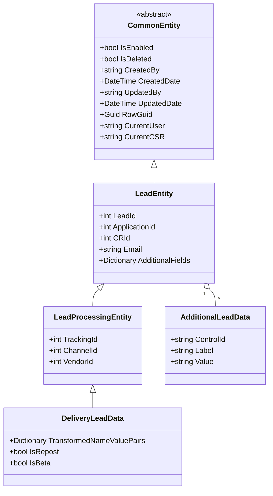
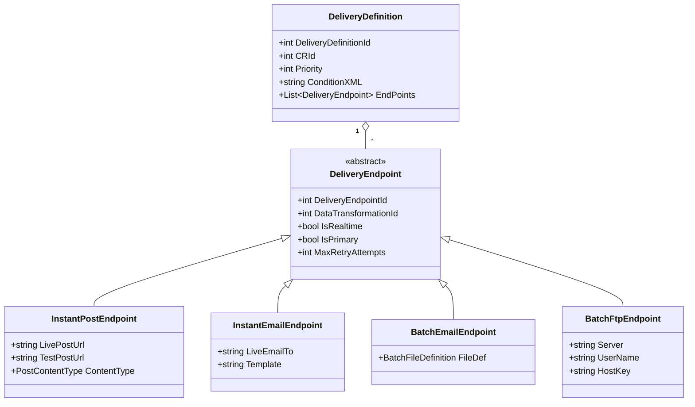
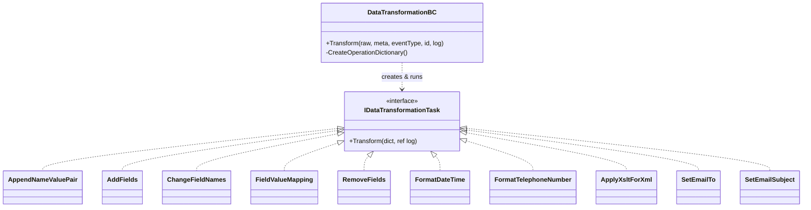
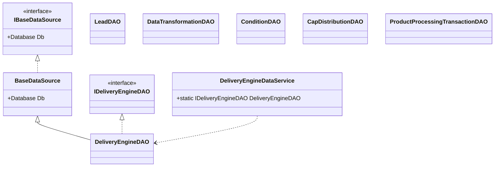

# 27. Class Diagrams

## Entity: lead & audit base

```mermaid
classDiagram
    class CommonEntity {
        <<abstract>>
        +bool IsEnabled
        +bool IsDeleted
        +string CreatedBy
        +DateTime CreatedDate
        +string UpdatedBy
        +DateTime UpdatedDate
        +Guid RowGuid
        +string CurrentUser
        +string CurrentCSR
    }
    class LeadEntity {
        +int LeadId
        +int ApplicationId
        +int CRId
        +string Email
        +Dictionary AdditionalFields
    }
    class LeadProcessingEntity {
        +int TrackingId
        +int ChannelId
        +int VendorId
    }
    class DeliveryLeadData {
        +Dictionary TransformedNameValuePairs
        +bool IsRepost
        +bool IsBeta
    }
    class AdditionalLeadData {
        +string ControlId
        +string Label
        +string Value
    }
    CommonEntity <|-- LeadEntity
    LeadEntity <|-- LeadProcessingEntity
    LeadProcessingEntity <|-- DeliveryLeadData
    LeadEntity "1" o-- "*" AdditionalLeadData
```

## Entity: delivery definition & endpoints

```mermaid
classDiagram
    class DeliveryDefinition {
        +int DeliveryDefinitionId
        +int CRId
        +int Priority
        +string ConditionXML
        +List~DeliveryEndpoint~ EndPoints
    }
    class DeliveryEndpoint {
        <<abstract>>
        +int DeliveryEndpointId
        +int DataTransformationId
        +bool IsRealtime
        +bool IsPrimary
        +int MaxRetryAttempts
    }
    class InstantPostEndpoint {
        +string LivePostUrl
        +string TestPostUrl
        +PostContentType ContentType
    }
    class InstantEmailEndpoint {
        +string LiveEmailTo
        +string Template
    }
    class BatchEmailEndpoint {
        +BatchFileDefinition FileDef
    }
    class BatchFtpEndpoint {
        +string Server
        +string UserName
        +string HostKey
    }
    DeliveryDefinition "1" o-- "*" DeliveryEndpoint
    DeliveryEndpoint <|-- InstantPostEndpoint
    DeliveryEndpoint <|-- InstantEmailEndpoint
    DeliveryEndpoint <|-- BatchEmailEndpoint
    DeliveryEndpoint <|-- BatchFtpEndpoint
```

## Transformation pipeline (Strategy)

```mermaid
classDiagram
    class IDataTransformationTask {
        <<interface>>
        +Transform(dict, ref log)
    }
    class DataTransformationBC {
        +Transform(raw, meta, eventType, id, log)
        -CreateOperationDictionary()
    }
    class AppendNameValuePair
    class AddFields
    class ChangeFieldNames
    class FieldValueMapping
    class RemoveFields
    class FormatDateTime
    class FormatTelephoneNumber
    class ApplyXsltForXml
    class SetEmailTo
    class SetEmailSubject
    IDataTransformationTask <|.. AppendNameValuePair
    IDataTransformationTask <|.. AddFields
    IDataTransformationTask <|.. ChangeFieldNames
    IDataTransformationTask <|.. FieldValueMapping
    IDataTransformationTask <|.. RemoveFields
    IDataTransformationTask <|.. FormatDateTime
    IDataTransformationTask <|.. FormatTelephoneNumber
    IDataTransformationTask <|.. ApplyXsltForXml
    IDataTransformationTask <|.. SetEmailTo
    IDataTransformationTask <|.. SetEmailSubject
    DataTransformationBC ..> IDataTransformationTask : creates & runs
```

## DAO / DataService layer

```mermaid
classDiagram
    class IBaseDataSource {
        <<interface>>
        +Database Db
    }
    class BaseDataSource {
        +Database Db
    }
    class IDeliveryEngineDAO {
        <<interface>>
    }
    class DeliveryEngineDAO
    class LeadDAO
    class DataTransformationDAO
    class ConditionDAO
    class CapDistributionDAO
    class ProductProcessingTransactionDAO
    class DeliveryEngineDataService {
        +static IDeliveryEngineDAO DeliveryEngineDAO
    }
    IBaseDataSource <|.. BaseDataSource
    BaseDataSource <|-- DeliveryEngineDAO
    IDeliveryEngineDAO <|.. DeliveryEngineDAO
    DeliveryEngineDataService ..> DeliveryEngineDAO
```
