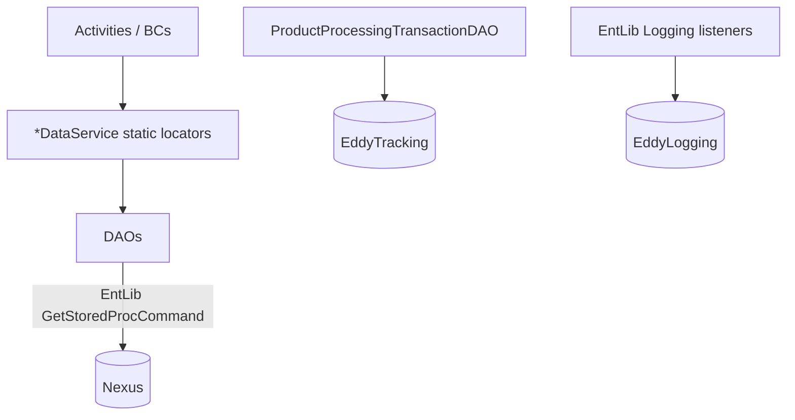
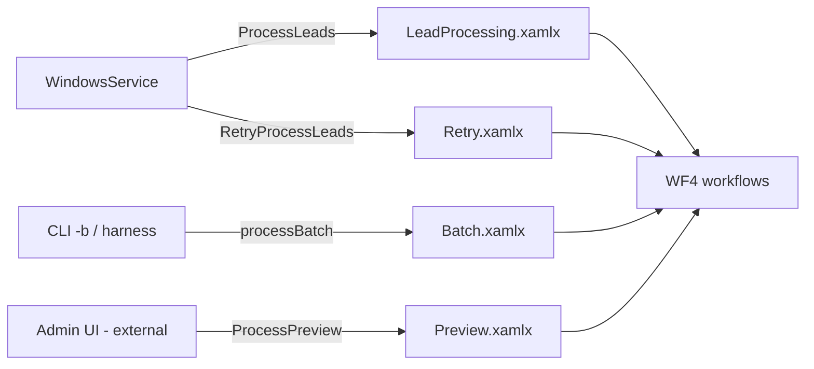
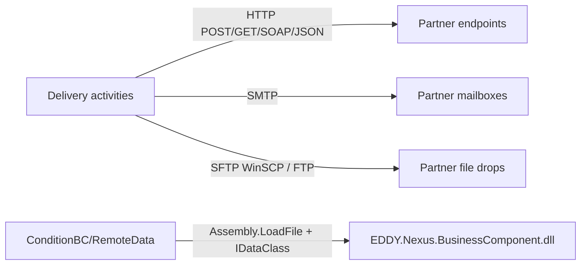
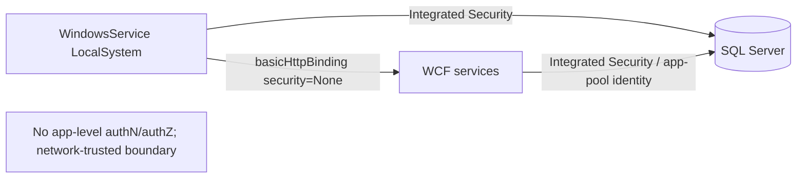
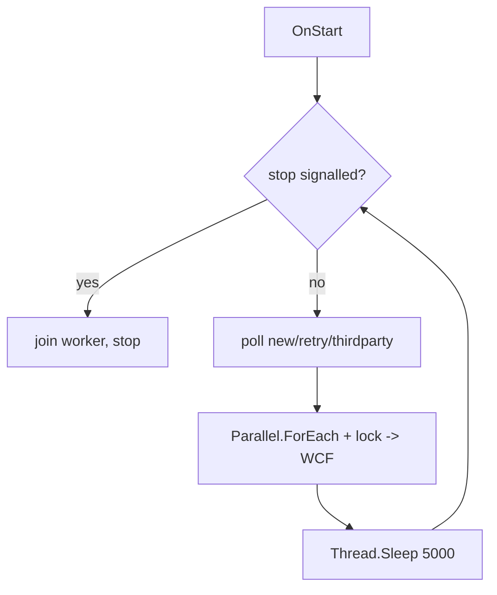

# 25. Data Flow Diagrams

## Request lifecycle (realtime lead)

```mermaid
flowchart LR
    NEW[New lead in Nexus] --> POLL[WindowsService poll]
    POLL --> WCF[ProcessLeads WCF call]
    WCF --> IDW[InstantDeliveryWF]
    IDW --> DEF[GetDeliveryDefinition + ConditionBC]
    DEF --> EP[Per endpoint]
    EP --> TX[TransformData -> DataTransformationBC]
    TX --> PAY[CreatePostData / CreateEmailBody]
    PAY --> SEND[DeliverInstantPost / DeliverInstantEmail]
    SEND --> INT[InterpretPostResponse]
    INT --> STAT[Adjust/Finalize status + RDQ update]
    STAT --> DB[(Nexus: status, logs, RDQ)]
```

## Database interactions

## Service interactions

## External API interactions

## Authentication flow

Confidence: **High** — no auth code exists; DB uses Integrated Security; WCF security mode is `None`.

## Background processing

