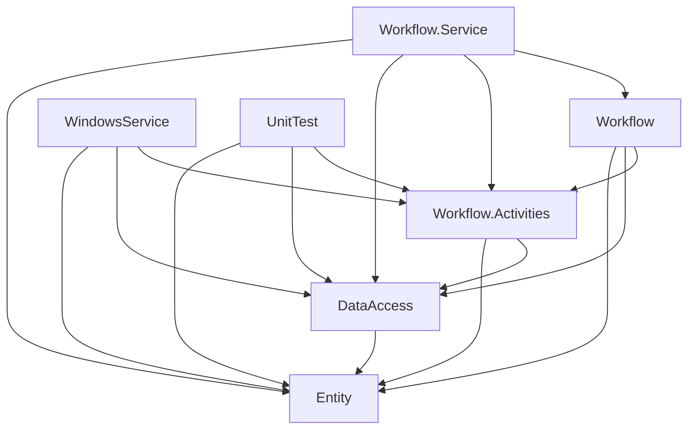
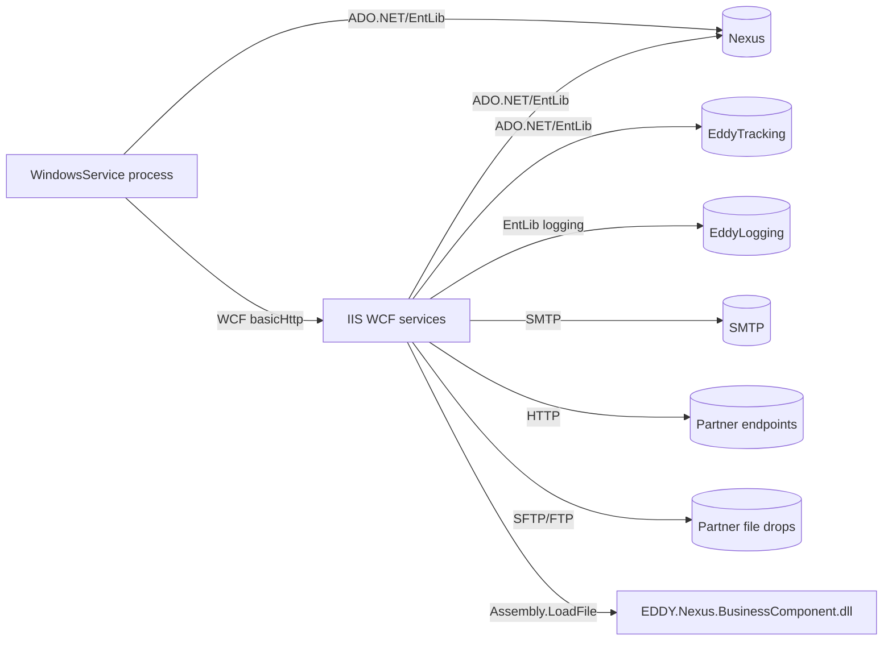
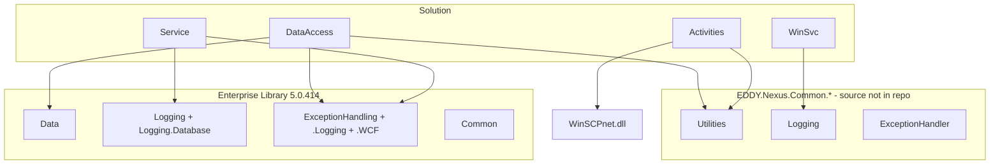

# 29. Dependency Graphs

## Project reference graph (build-time)

## Runtime dependency graph (process/service)

## External library dependencies

## Notable coupling observations

- `Entity` is a **stable hub** (everything depends on it; it depends on nothing internal).
- `DeliveryEngineDAO` is a **hotspot** (~3800 lines) that many activities/BCs reach through `DeliveryEngineDataService`.
- `WindowsService`↔`Workflow.Service` coupling is **contract-only** (WCF), not project references — the cleanest seam in the system and the natural place to re-platform.
