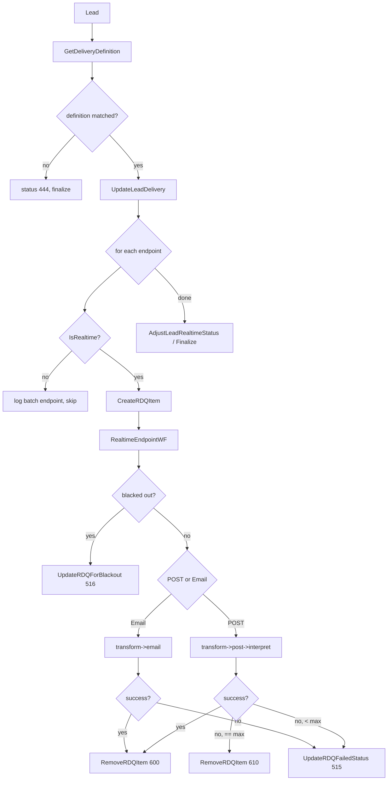
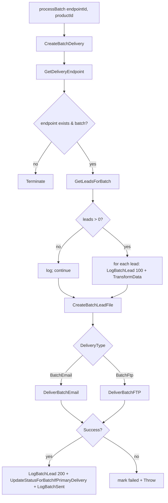
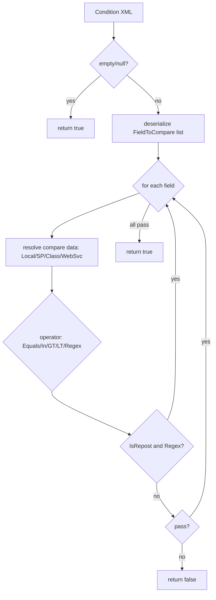
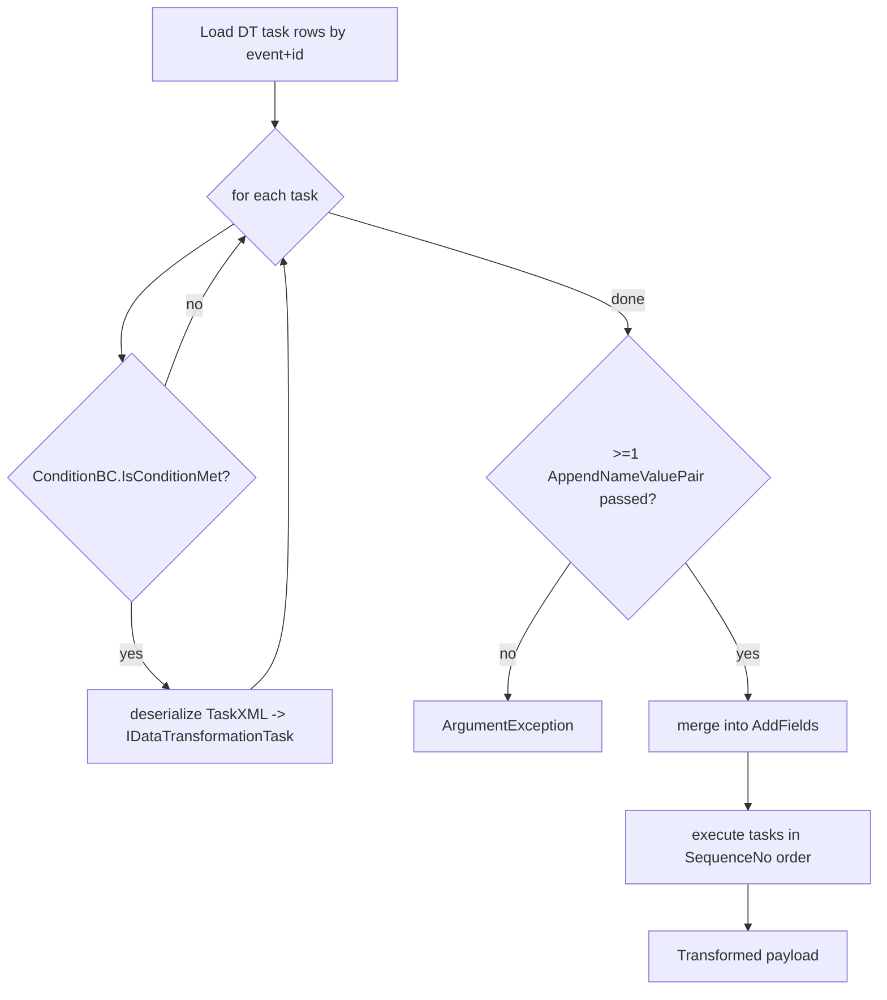

# 28. Flowcharts (Business Processes)

## Realtime delivery decision flow

```mermaid
flowchart TD
    A[Lead] --> B[GetDeliveryDefinition]
    B --> C{definition matched?}
    C -- no --> D[status 444, finalize]
    C -- yes --> E[UpdateLeadDelivery]
    E --> F{for each endpoint}
    F --> G{IsRealtime?}
    G -- no --> H[log batch endpoint, skip]
    G -- yes --> I[CreateRDQItem]
    I --> J[RealtimeEndpointWF]
    J --> K{blacked out?}
    K -- yes --> L[UpdateRDQForBlackout 516]
    K -- no --> M{POST or Email}
    M -- POST --> N[transform->post->interpret]
    M -- Email --> O[transform->email]
    N --> P{success?}
    P -- yes --> Q[RemoveRDQItem 600]
    P -- no, < max --> R[UpdateRDQFailedStatus 515]
    P -- no, == max --> S[RemoveRDQItem 610]
    O --> T{success?}
    T -- yes --> Q
    T -- no --> R
    F -->|done| U[AdjustLeadRealtimeStatus / Finalize]
```

## Batch delivery flow

```mermaid
flowchart TD
    A[processBatch endpointId, productId] --> B[CreateBatchDelivery]
    B --> C[GetDeliveryEndpoint]
    C --> D{endpoint exists & batch?}
    D -- no --> E[Terminate]
    D -- yes --> F[GetLeadsForBatch]
    F --> G{leads > 0?}
    G -- no --> H[log; continue]
    G -- yes --> I[for each lead: LogBatchLead 100 + TransformData]
    H --> J[CreateBatchLeadFile]
    I --> J
    J --> K{DeliveryType}
    K -- BatchEmail --> L[DeliverBatchEmail]
    K -- BatchFtp --> M[DeliverBatchFTP]
    L --> N{Success?}
    M --> N
    N -- yes --> O[LogBatchLead 200 + UpdateStatusForBatchIfPrimaryDelivery + LogBatchSent]
    N -- no --> P[mark failed + Throw]
```

## Condition evaluation flow

```mermaid
flowchart TD
    A[Condition XML] --> B{empty/null?}
    B -- yes --> C[return true]
    B -- no --> D[deserialize FieldToCompare list]
    D --> E{for each field}
    E --> F[resolve compare data: Local/SP/Class/WebSvc]
    F --> G{operator: Equals/In/GT/LT/Regex}
    G --> H{IsRepost and Regex?}
    H -- yes --> E
    H -- no --> I{pass?}
    I -- no --> J[return false]
    I -- yes --> E
    E -->|all pass| K[return true]
```

## Transformation task pipeline

```mermaid
flowchart TD
    A[Load DT task rows by event+id] --> B{for each task}
    B --> C{ConditionBC.IsConditionMet?}
    C -- no --> B
    C -- yes --> D[deserialize TaskXML -> IDataTransformationTask]
    D --> B
    B -->|done| E{>=1 AppendNameValuePair passed?}
    E -- no --> F[ArgumentException]
    E -- yes --> G[merge into AddFields]
    G --> H[execute tasks in SequenceNo order]
    H --> I[Transformed payload]
```
