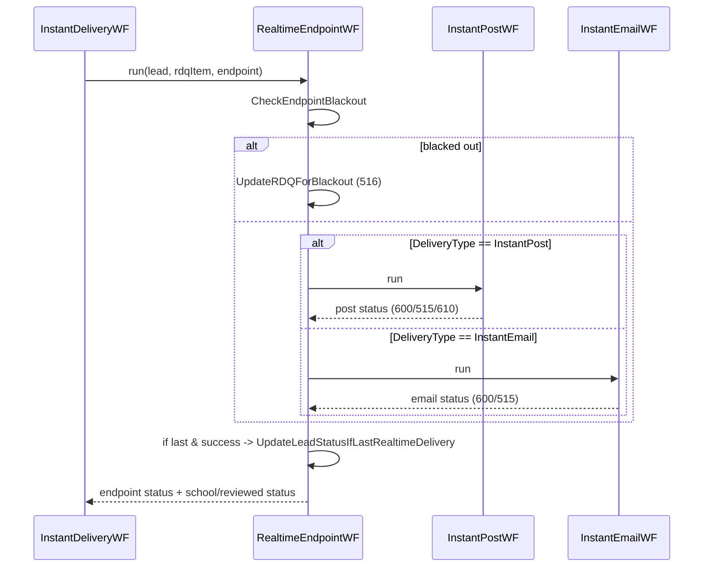
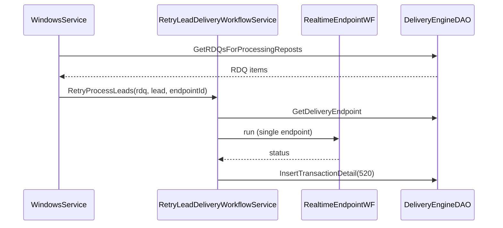
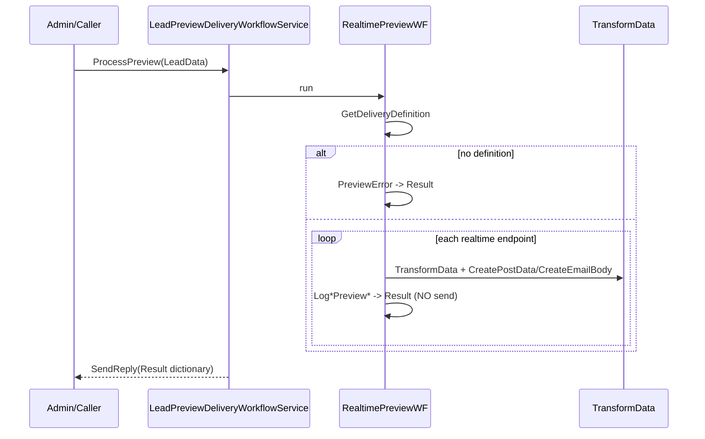

# 26. Sequence Diagrams (Major Workflows)

Additional sequences (realtime, batch, email) are inline in [../BusinessProcesses.md](../BusinessProcesses.md). This file adds the retry and preview sequences and the sub-workflow composition.

## Realtime endpoint dispatch (sub-workflow composition)



## Retry (RDQ repost)



## Preview (dry run)



## Lead processing service (one-way, full)

```mermaid
sequenceDiagram
    participant WS as WindowsService
    participant LPS as LeadProcessingDeliveryWorkflowService
    participant CFG as SeLeadProcessingConfigurationValues
    participant IDW as InstantDeliveryWF
    WS->>LPS: ProcessLeads(DeliveryLeadData)
    LPS->>LPS: InsertTransactionDetail(180)
    LPS->>CFG: get flags (ProcessCap=false, ScoreLead=false hardcoded; DeliverLead from config)
    opt ScoreLead
        LPS->>LPS: ScoreLead -> InsertTransactionDetail(190)
    end
    opt ProcessCap
        LPS->>LPS: ProcessCap -> InsertTransactionDetail(200)
    end
    opt DeliverLead
        LPS->>IDW: run -> FinalizeLeadDelivery -> InsertTransactionDetail(360)
    end
```
