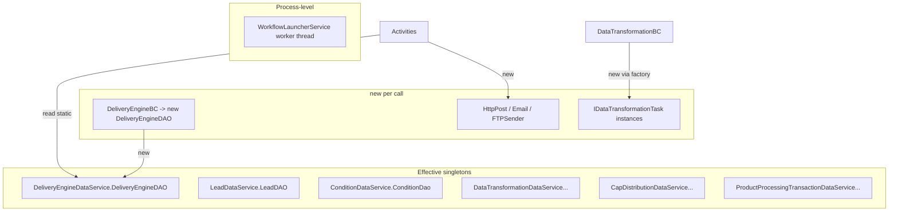

# 12. Dependency Injection & Object Lifetimes

**There is no DI container in use.** Unity DLLs are present only as transitive Enterprise Library build outputs under `bin/`/`obj/`; no `IUnityContainer`/`Resolve`/Unity config exists in source (grep-confirmed). Confidence: **High**.

## How dependencies are wired

## Lifetime taxonomy

| Requested category | Actual mechanism here | Example |
|--------------------|-----------------------|---------|
| **Singleton** | `static` DAO field in a `*DataService` holder | `DeliveryEngineDataService.DeliveryEngineDAO` |
| **Scoped** | none (no request scope; WCF per-call instances by default) | — |
| **Transient** | `new` per call | `new DeliveryEngineDAO()` in `DeliveryEngineBC`; helpers |
| **Factories** | task factory `switch` (`DataTransformationBC`), `BlackoutFactory` | transformation tasks / blackout types |
| **Hosted services** | `ServiceBase` + worker thread | `WorkflowLauncherService` |
| **Background services** | the poll loop thread | `ProcessDeliveryWorkflow` |
| **Locked singleton** | `lock(_Locker)` around DAO writes | `ProductProcessingTransactionManager` |

## Testability impact

Because dependencies are static/`new`'d, unit tests must **swap static fields** (`DeliveryEngineDataService.DeliveryEngineDAO = new DeliveryEngineDAOMock()`) rather than inject mocks. This is brittle and leaks global state across tests.

## Modernization recommendation

Introduce constructor injection with `Microsoft.Extensions.DependencyInjection`:
- Register `I*DAO` (scoped), transports (`IEmailSender`/`IHttpDeliverer`/`IFileTransfer` as typed clients), and business components.
- Replace static `*DataService` holders and `new` calls.
- Enables real mocking, per-request scope, and typed `HttpClient` with resilience (Polly).
