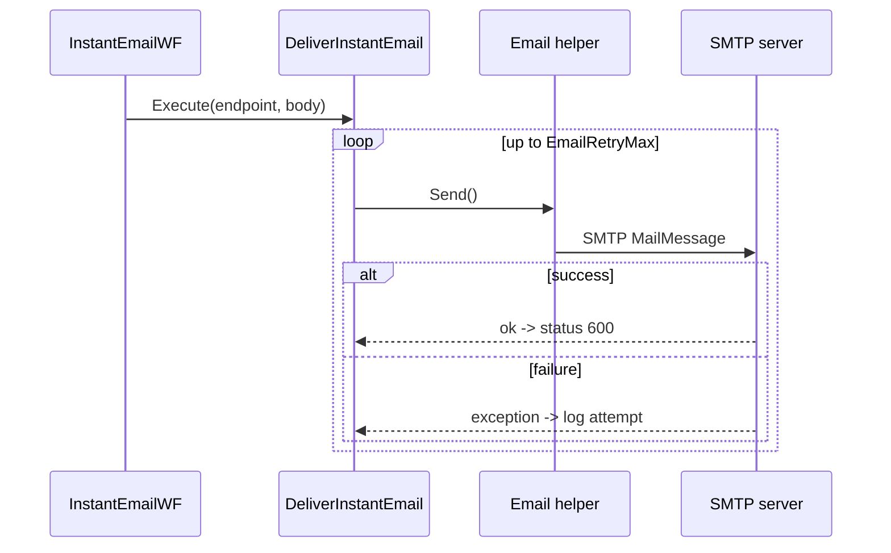

# 16. Integrations (Outbound External Systems)

## 1. SMTP email — `Helper/Email.cs`, `DeliverInstantEmail.cs`, `DeliverBatchEmail.cs`

| Aspect | Detail |
|--------|--------|
| Library | `System.Net.Mail` (`MailMessage`, `SmtpClient`) |
| Config | `AppSettings["DeliverySMTPServer"]`, `DeliveryEmailFrom`, `DeliveryEmailFromGS` (GS products 16/17) |
| Auth | `NetworkCredential(Username, Password)` if both set (`Email.cs:109-113`) |
| SSL | `EnableSsl` (note dead code comparing `EnableSSL == null` on a bool, `:116-120`) |
| Recipients | `,`→`;` normalization then split (`:62-85`); `SetEmailTo` task can resolve via SP `Eddy_DE_LookUpDeliveryEmail` |
| Retry | In callers (`EmailRetryMax`), not in helper |
| Errors | `throw ex;` (resets stack trace) (`:135-138`) |
| Rate limits | none |

## 2. HTTP POST/GET — `Helper/HTTPPost.cs`, `DeliverInstantPost.cs`

| Aspect | Detail |
|--------|--------|
| Library | `HttpWebRequest`/`HttpWebResponse` |
| Content types | Form (`x-www-form-urlencoded`), XML (`text/xml`, optional `SOAPAction`), JSON (`application/json`) |
| SOAP | Separate async path via `BeginGetResponse` (`:233-317`) |
| Headers | Custom `DeliveryPostHTTPHeader` list applied |
| **TLS** | ⚠️ **`TrustAllCert.OnValidationCallback` returns `true`**, assigned to global `ServicePointManager.ServerCertificateValidationCallback` per request (`:19-28,80-81`) — **all certificate validation disabled AppDomain-wide** |
| Disguise | Referer `www.google.com`, IE8 User-Agent (`:93-94`) |
| Retry | RDQ-based in `InstantPostWF` (up to `MaxRetryAttempts`) |
| Errors | `WebException` returns a `WebResponse` with status/body instead of throwing (`:136-165`) |
| Variable URL | `DeliverInstantPost` substitutes `{VariableURLSegment}` from lead fields (unit-tested) |

## 3. FTP / SFTP — `Helper/FTPSender.cs`, `DeliverBatchFTP.cs`

| Aspect | Detail |
|--------|--------|
| Routing | `FileProtocol=="SFTP"` → WinSCP; `"FTP"` → `FtpWebRequest` (`:29-33`) |
| SFTP lib | **WinSCP** (`Session`, `Protocol.Sftp`); auth user/pass + `SshHostKeyFingerprint` from `HostKey` (`:71-88`) |
| FTP | `ftp://{server}/{dir}/{file}`; `NetworkCredential`; 2KB buffer upload; `KeepAlive=false` (`:112-167`) |
| Credentials | From endpoint config (`UserName`/`Password`) passed by `DeliverBatchFTP` (`:40-41`) |
| Retry / errors | none; failures propagate |

## 4. External condition plug-ins — `ConditionValidator/RemoteData.cs`

| Aspect | Detail |
|--------|--------|
| Mechanism | `Assembly.LoadFile(ReferenceLibraryPath + "\EDDY.Nexus.BusinessComponent.dll")`; type `EDDY.Nexus.BusinessComponent.ConditionValidator.{className}`; `Activator.CreateInstance` → `IDataClass.GetData` (`:56-77`) |
| Purpose | Pluggable custom condition data sources for the rules engine |
| Risk | Dynamic assembly load by path + reflection instantiation (see [../Security/](../Security/)) |

## 5. SQL Server & EntLib logging

Covered in [../Database/](../Database/) and [../Architecture.md](../Architecture.md) §3.7. Outbound EntLib **email alert** listener (`Web.config:13`) sends error emails to a hardcoded address via SMTP IP `165.212.65.102` (currently commented out of category sources).

## Integration configuration summary

| Integration | Endpoint/host source |
|-------------|----------------------|
| SMTP (delivery) | `DeliverySMTPServer` app setting |
| SMTP (alerts) | EntLib email listener (`Web.config:13`) |
| HTTP | endpoint `LivePostUrl`/`TestPostUrl` (DB) |
| FTP/SFTP | endpoint `URI`/`TestURL`/`UserName`/`Password`/`HostKey`/`RemoteFolder` (DB) |
| External DLL | `ReferenceLibraryPath` app setting |
